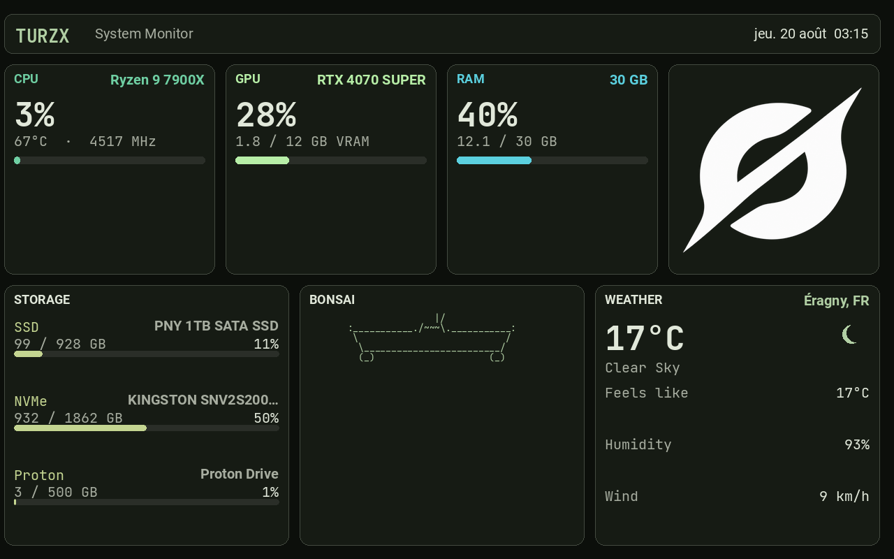

# TURZX 8" screen: what actually made it work

If your Turing / TURZX USB panel shows a sideways strip or stuck vendor wallpaper on Linux, start here. This is the orientation and USB-size bring-up story.

USB `1cbe:0080` TURZX1.0, 8" panel, mounted landscape-wide. Custom dashboard at `~/Documents/dashboard`. USB driver / protocol code comes from [turing-smart-screen-python](https://github.com/mathoudebine/turing-smart-screen-python) (local clone at `~/Documents/turing-smart-screen-python`, TUR_USB revision).

This screen lied to me a lot.

## Start here

Draw at **1280×800**, library sends **800×1280** on USB (`ROTATE_270`, do not disable). Wrong size → sideways strip + TURZX V2 wallpaper ghost.

```bash
systemctl --user restart turzx-dashboard.service
journalctl --user -u turzx-dashboard.service -n 3 --no-pager   # expect SEND: (800, 1280)
```

Live code: `~/Documents/dashboard/`. Ambient / game mode / speedtest: [ambient-screens](../ambient-screens/).



## Hardware facts that are easy to get wrong

- The USB product table still reports native portrait as 800×1280.
- On this unit, the library's portrait / landscape names do not match what you see on the glass.
- Firmware framebuffer is portrait. Windows and cold-plug leave it expecting an **800×1280** USB stream.
- Send a raw 1280×800 JPEG while the panel expects 800×1280 and you get a sideways strip plus leftover **TURZX V2** wallpaper on the rest of the glass.

## Working path

1. Draw the dashboard at 1280×800 (`renderer.py`).
2. Keep content upright with `CONTENT_ROTATE = 0` in `turzx_screen.py`.
3. `Orientation.LANDSCAPE` so the library canvas is 1280×800.
4. Library `DisplayPILImage` rotates **270°** before USB send → panel gets **800×1280**.
5. Do not zoom or crop (`DEFAULT_ZOOM = 1.0`, `DEFAULT_FIT = 1.0`, crop anchor `center`).

```bash
cd ~/Documents/dashboard
.venv/bin/python dashboard.py
```

## Change 1: keep stock library USB rotation

File: `~/Documents/turing-smart-screen-python/library/lcd/lcd_comm_turing_usb.py`  
Function: `LcdCommTuringUSB.DisplayPILImage`

Stock behaviour (keep it):

| Orientation | USB transpose | Bytes on the wire |
|---|---|---|
| `LANDSCAPE` | `ROTATE_270` | 800×1280 |
| `REVERSE_LANDSCAPE` | `ROTATE_90` | 800×1280 |
| `PORTRAIT` | `ROTATE_180` | 800×1280 |
| `REVERSE_PORTRAIT` | none | 800×1280 |

An earlier experiment disabled those `transpose(...)` branches and sent the 1280×800 canvas as-is. That looked fine until a Windows boot / cable replug left the panel in stock portrait mode again. Then the glass showed a sideways dashboard strip and TURZX V2 on the side.

`SetOrientation()` still picks canvas size. The library owns the portrait USB convert. The dashboard owns content flip (`CONTENT_ROTATE`) and scale.

There is a leftover debug `print("SEND:", ...)`. Useful when checking wire size (`SEND: (800, 1280) ... orientation: LANDSCAPE`).

## Change 2: landscape canvas, no content flip

File: `~/Documents/dashboard/turzx_screen.py`

| Setting | Value | Why |
|---|---|---|
| `NATIVE_WIDTH` / `NATIVE_HEIGHT` | 1280 × 800 | Canvas before USB rotate |
| `LCD_ORIENTATION` | `Orientation.LANDSCAPE` | Matches that canvas |
| `CONTENT_ROTATE` | 0 | Upright after library `ROTATE_270` |
| `DEFAULT_SCALE` | `letterbox` | Keep aspect ratio |
| `DEFAULT_ZOOM` | 1.0 | Zoom > 1 crops edges |
| `DEFAULT_FIT` | 1.0 | Fill the 1280×800 canvas |
| `DEFAULT_CROP_ANCHOR` | `center` | No corner crop |

`LcdCommTuringUSB.__init__` still overwrites width/height from `PRODUCT_ID` (800×1280 for `0x0080`). Orientation `LANDSCAPE` swaps those via `get_width()` / `get_height()`, so the software canvas is 1280×800. USB send is 800×1280 after transpose.

If placement is full-screen but upside down, try `CONTENT_ROTATE = 180` before touching the library rotate again.

## Change 3: keep the layout wide

Files: `~/Documents/dashboard/renderer.py`, `dashboard.py`

Layout stays 1280×800 (header + metric cards + Network / System / Activity). Do not rebuild a portrait UI for 800×1280. The library rotate is what matches the firmware, not a portrait layout.

`--nudge-x/y`, `--fit`, and `--zoom` are still there for fine-tuning. The defaults above are the working set.

## After Windows or a cable unplug

1. Confirm USB: `lsusb -d 1cbe:0080`
2. Restart the daemon: `systemctl --user restart turzx-dashboard.service`
3. If you still see TURZX V2 + a sideways strip, the library rotate was disabled or `CONTENT_ROTATE` is wrong. Wire size in the journal should be `(800, 1280)`, not `(1280, 800)`.

Optional hard wipe (stops the service, sends a black 800×1280, then one good frame):

```bash
systemctl --user stop turzx-dashboard.service
# then start again once the library path is correct
systemctl --user start turzx-dashboard.service
```

## What failed

| Approach | Result |
|---|---|
| Disable library USB rotate, send raw 1280×800 | Works until Windows/cold-plug; then sideways strip + TURZX V2 |
| `CONTENT_ROTATE = 180` with stock `ROTATE_270` | Full screen but upside down on this mount |
| `REVERSE_PORTRAIT` + 800×1280 send of a 1280×800 image | Wrap / split / missing cards |
| Library `PORTRAIT` canvas for the live dashboard | Tall buffer → wrong layout |
| `--zoom 1.2` + crop `top-right` | Top and right of the dashboard cut off |
| Fractional `--offset-y` (e.g. 0.5) | Dead zone / jump |
| Stretch 1280×800 → 800×1280 in the dashboard | Distorted; library rotate is the right convert |

## Positioning rules if you nudge later

- Integer pixel `--nudge-x` / `--nudge-y` from center. Not fractional offsets.
- Keep `--zoom 1.0` unless you accept cropped edges.
- `--fit` below 1.0 shrinks the image and adds margin. Not needed for the working layout.

## Paths

| Piece | Path |
|---|---|
| Dashboard | `~/Documents/dashboard/` |
| Screen defaults | `~/Documents/dashboard/turzx_screen.py` |
| Layout | `~/Documents/dashboard/renderer.py` |
| USB library | `~/Documents/turing-smart-screen-python/library/lcd/lcd_comm_turing_usb.py` |
| Official config (reference) | `~/Documents/turing-smart-screen-python/config.yaml` — `REVISION: TUR_USB`, theme `8inchTheme2` |
| Boot daemon | `~/.config/systemd/user/turzx-dashboard.service` |

## Related

- [Refresh upgrade spike](../refresh-upgrade-spike/) — full-frame ceiling (~4.7 fps), no true partial USB via the library

## Boot daemon

`turzx-dashboard.service` starts after login, and at boot if lingering is on. It waits on `network-online.target` so the weather card does not race DNS. It conflicts with the old `turing-smart-screen.service` because the USB device is exclusive.

```bash
systemctl --user daemon-reload
systemctl --user enable --now turzx-dashboard.service
loginctl enable-linger "$USER"   # start at boot, before login
```

```bash
systemctl --user status turzx-dashboard.service
systemctl --user restart turzx-dashboard.service
systemctl --user stop turzx-dashboard.service
```
