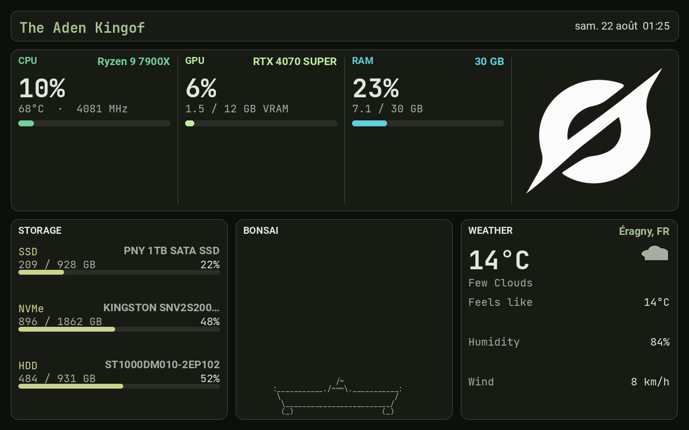

# TURZX host-engine refresh

How the always-on dashboard pushes frames to the USB panel: refresh rate, skipping unchanged pixels, and an optional H.264 path. Read this after [Process](../Process/) if you care about performance, not orientation.

Aug 2026. Built on [refresh upgrade spike](../refresh-upgrade-spike/) measurements (~5 fps full-frame ceiling on JPEG; dirty-rect USB does not help on the public library path).

Live code: `~/Documents/dashboard`. Copies here drift; trust live paths.



## Start here

**Boot default:** `turzx-dashboard.service` pushes JPEG frames over USB at ~1 Hz when idle. Caelestia scheme changes burst to 0.25 s for 8 s. Speedtest and ambient modes ignore dirty skip and repaint every frame they need.

**What you see** depends on view priority (speedtest → peek → game mode → ambient). Ambient details: [ambient-screens](../ambient-screens/).

**Restart:**

```bash
systemctl --user restart turzx-dashboard.service
```

**Sanity:**

```bash
systemctl --user is-active turzx-dashboard.service
journalctl --user -u turzx-dashboard.service -n 5 --no-pager | rg 'SEND|palette'
# expect: SEND: (800, 1280) … orientation: LANDSCAPE
```

**Do not** run H.264 and the service on USB at the same time. Toggle: `~/.config/hypr/scripts/toggle_h264_live.sh`.

## Dual-rate + dirty skip

`dashboard.py` + `frame_dirty.py`:

| Mode | Sleep | Dirty skip |
|------|-------|------------|
| Idle | 1.0 s (`--idle-interval`) | Yes |
| Scheme burst (8 s after palette change) | 0.25 s (`--busy-interval`) | Yes |
| Speedtest gauges | 0 (`--speedtest-interval`) | No |
| Ambient terminal | 0 extra (`--ambient-interval`; capture waits in `poll()`) | No |

Busy burst fires when Caelestia scheme name/hash changes. Speedtest runs flat out (~4.7–5 fps measured). Idle stays cheap on CPU.

Fingerprint skips USB when unchanged: scheme identity, speedtest fields, clock minute, rounded stats. View name is in the fingerprint so ambient ↔ stats always repaints.

Wire size stays **800×1280**: `CONTENT_ROTATE = 0`, `Orientation.LANDSCAPE`, stock library `ROTATE_270`. Do not skip library rotate. [Process](../Process/) explains why.

## Shared top plate

CPU, GPU, RAM, and the picture card share one rounded plate with vertical dividers. Four separate cards used to share a bottom edge; H.264 turned that into a full-width line through the sparklines.

## Ambient + stats views

Same service, different render path. Stats use `renderer.render()`. Ambient uses `render_terminal()` on an 80×24 ANSI grid. See [ambient-screens](../ambient-screens/).

## Service

```bash
systemctl --user restart turzx-dashboard.service
```

Unit snapshot: [`turzx-dashboard.service`](turzx-dashboard.service). Live: `~/.config/systemd/user/turzx-dashboard.service` (+ `PYTHONUNBUFFERED=1` drop-in).

## H.264 (opt-in; JPEG stays boot default)

Not in `turzx-dashboard.service`. Encoder exits clean (cmd 123 + still restore). Refuses to start if the JPEG service still holds USB.

Toggle script: [`toggle_h264_live.sh`](toggle_h264_live.sh) → live `~/.config/hypr/scripts/toggle_h264_live.sh`

```bash
~/.config/hypr/scripts/toggle_h264_live.sh   # stop JPEG service → start H.264
~/.config/hypr/scripts/toggle_h264_live.sh   # stop H.264 → restart JPEG service
```

Pidfile: `~/.local/state/turzx/h264_live.pid`. Log: `$XDG_RUNTIME_DIR/turzx-h264-live.log`. `TURZX_H264_FPS` default 15.

Manual sandwich:

```bash
systemctl --user stop turzx-dashboard.service
cd ~/Documents/dashboard && .venv/bin/python turzx_h264_live.py --seconds 12 --fps 15
systemctl --user start turzx-dashboard.service
```

After aborting H.264, confirm service is `active`, journal shows `SEND: (800, 1280)`, glass upright (no sideways strip + TURZX V2 leftover).

Spike notes and probes: [refresh-upgrade-spike](../refresh-upgrade-spike/).

## Live paths

| Piece | Path |
|-------|------|
| Loop | `~/Documents/dashboard/dashboard.py` |
| Dirty / busy | `~/Documents/dashboard/frame_dirty.py` |
| Layout | `~/Documents/dashboard/renderer.py` |
| Orientation | `~/Documents/dashboard/turzx_screen.py` |
| Speedtest state | `~/Documents/dashboard/speedtest_state.py` |
| Ambient / capture / game mode | [ambient-screens](../ambient-screens/) |
| Service | `~/.config/systemd/user/turzx-dashboard.service` |
| H.264 toggle | `~/.config/hypr/scripts/toggle_h264_live.sh` |
| Speedtest bind | [Speedtest widget](../../Speedtest-widget/) |
| Firmware explore | [custom-firmware-explore](../custom-firmware-explore/) |

## Copies in this folder

| File | Role |
|------|------|
| `dashboard.py` | Loop + view priority |
| `frame_dirty.py` | Fingerprint + scheme burst |
| `renderer.py` | Stats layout + `render_terminal` |
| `ambient_cycle.py` | Ambient rotation |
| `term_capture.py` | `script` capture |
| `game_mode.py` | Game detection |
| `dashboard_peek.py` | Peek state |
| `turzx-dashboard.service` | Unit snapshot |
| `turzx_h264_live.py`, `h264_usb.py` | H.264 experiment |
| `toggle_h264_live.sh` | JPEG ↔ H.264 |
| `preview-shared-plate.png` | Layout screenshot |

## Related

- [Process](../Process/) — orientation / stock rotate
- [Refresh upgrade spike](../refresh-upgrade-spike/) — fps ceiling, probes
- [Ambient screens](../ambient-screens/) — terminal apps, binds, black-screen traps
- [Speedtest widget](../../Speedtest-widget/) — `Super+Shift+F`
